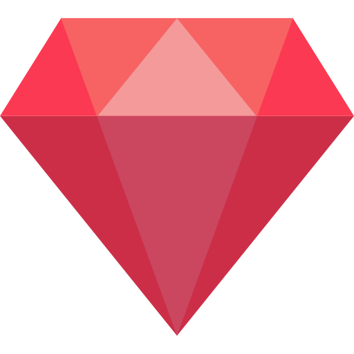

# Portfolio de Paul Brion

  

### [https://brion-portfolio.vercel.app/](https://brion-portfolio.vercel.app/)

Voici mon portfolio où je liste tous mes projets open-source.

## Technologies utilisées pour la conception de ce site internet

- [Deno](https://deno.com/)
- [Typescript](https://www.typescriptlang.org/)
- [Vue](https://vuejs.org/)
- [Vite](https://vitejs.dev/)
- [Pinia](https://pinia.vuejs.org/)
- [Vue Router](https://router.vuejs.org/)
- [Sass](https://sass-lang.com/)

## Technologies utilisées pour le déploiement de ce site internet

- [Vercel](https://vercel.com/)